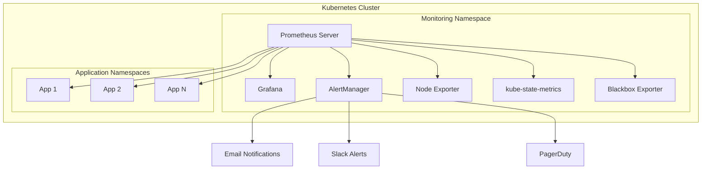

# Kubernetes Monitoring Stack: Prometheus, Grafana & AlertManager

[](https://kubernetes.io/)
[](https://prometheus.io/)
[](https://grafana.com/)
[](https://helm.sh/)

**Production-ready monitoring stack for Kubernetes clusters with comprehensive observability, alerting, and visualization.**

## 🚀 Overview

This repository provides a complete monitoring solution for Kubernetes clusters featuring:

- **Prometheus**: Metrics collection and storage
- **Grafana**: Visualization and dashboards
- **AlertManager**: Intelligent alerting and notification routing
- **Node Exporter**: Host-level metrics
- **kube-state-metrics**: Kubernetes object metrics
- **Blackbox Exporter**: Endpoint monitoring

## 📋 Prerequisites

Before deploying, ensure you have:

- **Kubernetes cluster** (v1.20+) with admin access
- **Helm 3.x** installed and configured
- **kubectl** configured for your cluster
- **Persistent storage** available (for data retention)
- **LoadBalancer** or **Ingress Controller** (for external access)

## 🚀 Quick Start

### 1. Deploy the Complete Monitoring Stack

```bash
# Clone the repository
git clone https://github.com/soodrajesh/k8s-grafana-prometheus.git
cd k8s-grafana-prometheus

# Create monitoring namespace
kubectl create namespace monitoring

# Deploy using Helm
helm install monitoring-stack ./helm/monitoring-stack -n monitoring

# Verify deployment
kubectl get pods -n monitoring
```

### 2. Access the Services

**Grafana Dashboard:**
```bash
# Port forward to access Grafana
kubectl port-forward -n monitoring svc/grafana 3000:80

# Access at: http://localhost:3000
# Default credentials: admin/admin (change on first login)
```

**Prometheus UI:**
```bash
# Port forward to access Prometheus
kubectl port-forward -n monitoring svc/prometheus-server 9090:80

# Access at: http://localhost:9090
```

**AlertManager:**
```bash
# Port forward to access AlertManager
kubectl port-forward -n monitoring svc/alertmanager 9093:80

# Access at: http://localhost:9093
```

## 🏗️ Architecture


    
    -   Build and push the Docker image to ECR.
    -   Update the Kubernetes deployment with the new image.

### 3. Deployment Verification

After a successful pipeline run, verify the deployment by checking the status of your pods:

````kubectl get pods --namespace default````

### 4. Troubleshooting

If deployment issues arise, check the GitHub Actions logs and review pod logs:

```kubectl logs <pod-name> --namespace default```

#### 5. Cleanup

```kubectl delete deployment sample-app --namespace default```

## 📊 Features

### 🎯 **Comprehensive Monitoring**
- **Cluster Metrics**: CPU, Memory, Network, Storage
- **Application Metrics**: Custom application metrics
- **Infrastructure Metrics**: Node-level system metrics
- **Kubernetes Metrics**: Pod, Service, Deployment status

### 📈 **Pre-built Dashboards**
- **Kubernetes Cluster Overview**
- **Node Metrics Dashboard**
- **Pod Resource Usage**
- **Application Performance**
- **Alert Status Overview**

### 🔔 **Intelligent Alerting**
- **Resource Exhaustion**: CPU, Memory, Disk alerts
- **Service Availability**: Endpoint monitoring
- **Custom Alerts**: Business-specific metrics
- **Multi-channel Notifications**: Email, Slack, PagerDuty

## ⚙️ Configuration

### Customizing Values

Edit `helm/monitoring-stack/values.yaml` to customize:

```yaml
# Prometheus configuration
prometheus:
  retention: "15d"
  storage: "50Gi"
  resources:
    requests:
      cpu: "500m"
      memory: "2Gi"

# Grafana configuration
grafana:
  adminPassword: "your-secure-password"
  persistence:
    enabled: true
    size: "10Gi"

# AlertManager configuration
alertmanager:
  config:
    global:
      smtp_smarthost: 'your-smtp-server:587'
    route:
      group_by: ['alertname']
      receiver: 'default'
```

### Adding Custom Alerts

Create custom alert rules in `helm/monitoring-stack/templates/prometheus-rules.yaml`:

```yaml
apiVersion: monitoring.coreos.com/v1
kind: PrometheusRule
metadata:
  name: custom-alerts
spec:
  groups:
  - name: custom.rules
    rules:
    - alert: HighCPUUsage
      expr: cpu_usage_percent > 80
      for: 5m
      labels:
        severity: warning
      annotations:
        summary: "High CPU usage detected"
```

## 🔒 Security Best Practices

- **RBAC**: Least privilege access controls
- **Network Policies**: Restricted inter-pod communication
- **Secret Management**: Encrypted storage of sensitive data
- **TLS**: Encrypted communication between components
- **Authentication**: Grafana LDAP/OAuth integration

## 🚀 Production Deployment

### High Availability Setup

```bash
# Deploy with HA configuration
helm install monitoring-stack ./helm/monitoring-stack \
  --set prometheus.replicaCount=2 \
  --set grafana.replicaCount=2 \
  --set alertmanager.replicaCount=3 \
  -n monitoring
```

### External Access via Ingress

```yaml
# ingress.yaml
apiVersion: networking.k8s.io/v1
kind: Ingress
metadata:
  name: monitoring-ingress
  annotations:
    kubernetes.io/ingress.class: nginx
    cert-manager.io/cluster-issuer: letsencrypt-prod
spec:
  tls:
  - hosts:
    - grafana.yourdomain.com
    secretName: grafana-tls
  rules:
  - host: grafana.yourdomain.com
    http:
      paths:
      - path: /
        pathType: Prefix
        backend:
          service:
            name: grafana
            port:
              number: 80
```

## 📝 Maintenance

### Backup and Restore

```bash
# Backup Grafana dashboards
kubectl exec -n monitoring grafana-pod -- grafana-cli admin export-dashboard

# Backup Prometheus data
kubectl exec -n monitoring prometheus-pod -- tar -czf /tmp/prometheus-backup.tar.gz /prometheus
```

### Upgrading

```bash
# Update Helm chart
helm upgrade monitoring-stack ./helm/monitoring-stack -n monitoring

# Check rollout status
kubectl rollout status deployment/grafana -n monitoring
```

## 🤝 Contributing

1. Fork the repository
2. Create a feature branch
3. Make your changes
4. Add tests if applicable
5. Submit a pull request

## 📄 License

This project is licensed under the MIT License - see the [LICENSE](LICENSE) file for details.

## 🆘 Support

For issues and questions:
- Create an [Issue](https://github.com/soodrajesh/k8s-grafana-prometheus/issues)
- Check the [Wiki](https://github.com/soodrajesh/k8s-grafana-prometheus/wiki)
- Contact: [soodrajesh87@gmail.com](mailto:soodrajesh87@gmail.com)

---

**⭐ If this project helps you, please give it a star!**
