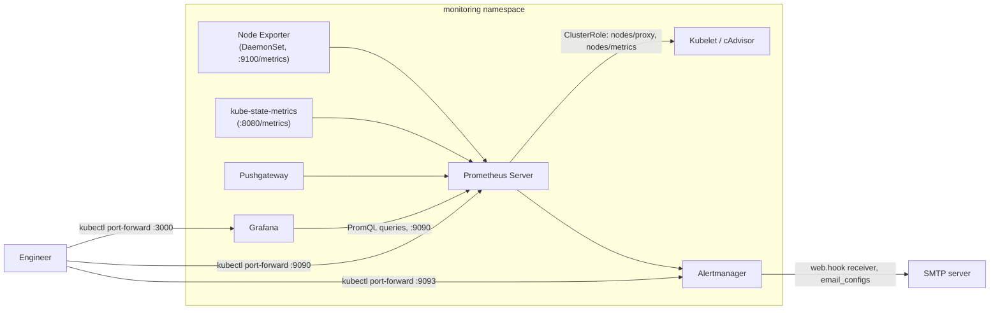

# Kubernetes Monitoring Stack: Prometheus, Grafana, Alertmanager

[](https://github.com/soodrajesh/Kubernetes-Prometheus-Grafana-Monitoring/actions/workflows/ci.yml)

A Helm chart that deploys Prometheus, Grafana, and Alertmanager onto a Kubernetes cluster, plus the RBAC, network policies, and service monitors needed to run them. I built this so I'd stop hand-rolling `kubectl apply` sequences every time I needed a monitoring stack on a cluster - it wraps the upstream community charts instead of reinventing scrape configs and dashboards.

## What this deploys

- **Prometheus server** (via the `prometheus-community/prometheus` chart) - scrapes metrics and evaluates alert rules
- **Node Exporter** and **kube-state-metrics** - shipped as part of the Prometheus chart dependency, giving host-level and Kubernetes-object-level metrics
- **Pushgateway** - for batch/cron job metrics that can't be scraped directly
- **Grafana** (via the `grafana/grafana` chart) - reads from Prometheus and ships with three community dashboards pulled by ID (cluster overview, pod monitoring, node-exporter-full)
- **Alertmanager** (via the `prometheus-community/alertmanager` chart) - deployed as its own dependency, with a single email receiver configured
- Custom RBAC (`ClusterRole`/`ClusterRoleBinding` for Prometheus to read nodes/pods/services and scrape `/metrics` and `/metrics/cadvisor`), optional `NetworkPolicy` resources, and `ServiceMonitor` CRs layered on top in `helm/monitoring-stack/templates/`

## Project structure

```
Kubernetes-Prometheus-Grafana-Monitoring/
├── LICENSE
├── README.md
├── SECURITY.md
├── helm/
│   └── monitoring-stack/          # the umbrella chart
│       ├── Chart.yaml             # declares prometheus, grafana, alertmanager as dependencies
│       ├── values.yaml            # sizing, storage, alert rules, dashboards, credentials
│       └── templates/
│           ├── _helpers.tpl
│           ├── rbac.yaml          # ServiceAccount + ClusterRoles for prometheus/grafana
│           ├── network-policy.yaml # pod-to-pod restrictions (disabled by default)
│           └── servicemonitor.yaml # ServiceMonitor CRs for prometheus/grafana/alertmanager
└── scripts/
    ├── deploy.sh                  # helm repo add + install/upgrade/uninstall/status
    └── backup.sh                  # dumps grafana + prometheus data and configmaps
```

## Architecture



I went with an umbrella chart that pulls in the upstream `prometheus-community/prometheus`, `grafana/grafana`, and `prometheus-community/alertmanager` charts as dependencies (pinned to specific versions in `Chart.yaml`) rather than writing Prometheus/Grafana manifests from scratch. That keeps me off the hook for tracking upstream config schema changes and lets me focus the custom code in this repo on the RBAC, network policy, and service monitor layer that's actually cluster-specific. Storage is a real cost/durability tradeoff I made explicit in `values.yaml`: Prometheus gets 50Gi with 15 days of retention, Grafana gets 10Gi, Alertmanager gets 2Gi, and the storage class defaults to `gp2` (EBS) but is overridable via `global.storageClass` for other providers. Resource requests/limits are set per-component rather than left blank, based on rough sizing for a small-to-medium cluster - they're not tuned against real workload data, just reasonable starting points to edit.

Three baseline alert rules (pod crash-looping, node not-ready, node memory pressure) are baked directly into `values.yaml` under `prometheus.serverFiles.alerting_rules.yml` rather than shipped as a separate `PrometheusRule` CRD, since this deployment doesn't run the Prometheus Operator - it's the standalone server chart. That decision has a real consequence, covered below.

## Deploying

Prerequisites: a Kubernetes cluster (v1.20+), Helm 3, `kubectl` pointed at the right context, and a storage class if you're not on EKS/gp2.

```bash
git clone https://github.com/soodrajesh/Kubernetes-Prometheus-Grafana-Monitoring.git
cd Kubernetes-Prometheus-Grafana-Monitoring

# fetch the chart dependencies (prometheus, grafana, alertmanager) - not vendored in this repo
helm dependency update ./helm/monitoring-stack

./scripts/deploy.sh deploy
```

`scripts/deploy.sh` adds the `prometheus-community` and `grafana` Helm repos, creates the `monitoring` namespace if it doesn't exist, and installs (or upgrades) the release named `monitoring-stack`. It also supports `./scripts/deploy.sh status` and `./scripts/deploy.sh uninstall`.

If you'd rather run it by hand:

```bash
kubectl create namespace monitoring
helm install monitoring-stack ./helm/monitoring-stack -n monitoring
```

### Access

Everything is `ClusterIP` by default - there's no ingress or LoadBalancer wired up, so port-forward is the way in:

```bash
kubectl port-forward -n monitoring svc/monitoring-stack-grafana 3000:80        # http://localhost:3000, admin/admin123
kubectl port-forward -n monitoring svc/monitoring-stack-prometheus-server 9090:80
kubectl port-forward -n monitoring svc/monitoring-stack-alertmanager 9093:80
```

Service names come from the Helm release name (`monitoring-stack`) plus each subchart's naming convention - run `kubectl get svc -n monitoring` after install to confirm the exact names on your cluster before scripting against them.

### Backup

```bash
./scripts/backup.sh
```

Dumps Grafana's dashboard export and `/var/lib/grafana` data, a Prometheus data directory snapshot, ConfigMaps, and a redacted Secrets structure into a timestamped folder under `./backups/`. It shells into the running pods with `kubectl exec`/`kubectl cp`, so it only works while the stack is up - there's no scheduled/automated backup (no CronJob, no off-cluster storage target).

## Known gaps

- **Alertmanager isn't actually wired to Prometheus in `values.yaml`.** Both are deployed as separate top-level chart dependencies, but there's no `prometheus.alertmanagers` (or equivalent `serverFiles`) config pointing the Prometheus server at the Alertmanager service. The three baked-in alert rules will evaluate and fire in Prometheus, but without that wiring they won't reach Alertmanager for routing/notification. That's a manual step still needed.
- **The `ServiceMonitor` CRs in `templates/servicemonitor.yaml` require the Prometheus Operator CRDs (`monitoring.coreos.com/v1`) to already exist in the cluster**, but this chart deploys the standalone Prometheus server chart, not the Operator. Unless a Prometheus Operator is running elsewhere in the cluster to consume them, those `ServiceMonitor` objects will apply but nothing will act on them.
- **No TLS anywhere.** Grafana, Prometheus, and Alertmanager are all plain HTTP behind `ClusterIP`, accessed via port-forward. There's no ingress, no cert-manager integration, no auth in front of Prometheus or Alertmanager.
- **Grafana admin password is hardcoded in `values.yaml`** (`admin123`, in plaintext, set twice - once under `grafana.adminPassword` and again under `grafana.ini` `security.admin_password`). It isn't pulled from a Kubernetes Secret. `SECURITY.md` tells you to change it; nothing in the chart enforces that.
- **`NetworkPolicy` resources exist but are disabled by default** (`networkPolicies.enabled: false`). They're written and templated but never applied unless you flip that flag.
- **Alertmanager's SMTP config is a placeholder** (`localhost:587`, `alertmanager@yourdomain.com`), and the Slack receiver block in `values.yaml` is commented out. Email is the only notification path, and it needs a real SMTP host before it'll deliver anything.
- **CI validates rendering, not a live deploy.** The `Helm Chart CI` GitHub Actions workflow (`.github/workflows/ci.yml`) runs `helm dependency update`, `helm lint`, and `helm template` (default values, plus `networkPolicies.enabled=true`) against `helm/monitoring-stack` on every push/PR touching `helm/**`. That catches dependency-resolution failures, lint errors, and templating errors before merge - it does not spin up a cluster, install the chart, or verify the pods actually come up healthy. Install verification against a real cluster is still a manual step.
- **Chart dependencies aren't vendored.** `helm dependency update` has to reach `prometheus-community.github.io` and `grafana.github.io` at install/build time; there's no `Chart.lock` or `charts/*.tgz` committed, so a pin-and-vendor step would be needed for air-gapped or fully reproducible installs.
- **Single replica everywhere** (`prometheus.server.replicaCount: 1`, `grafana.replicas: 1`, `alertmanager.replicaCount: 1`). No HA, no pod disruption budgets. Fine for a single small cluster, not for anything that needs to survive a node drain without a monitoring gap.
- **`scripts/backup.sh` calls `grafana-cli admin export-dashboard`**, which isn't a real `grafana-cli` subcommand in current Grafana versions. It's wrapped in `|| true` so it fails silently rather than blocking the rest of the backup - worth replacing with an actual dashboard export via the Grafana HTTP API if this backup script is going to be relied on.

## License

MIT - see [LICENSE](LICENSE).
